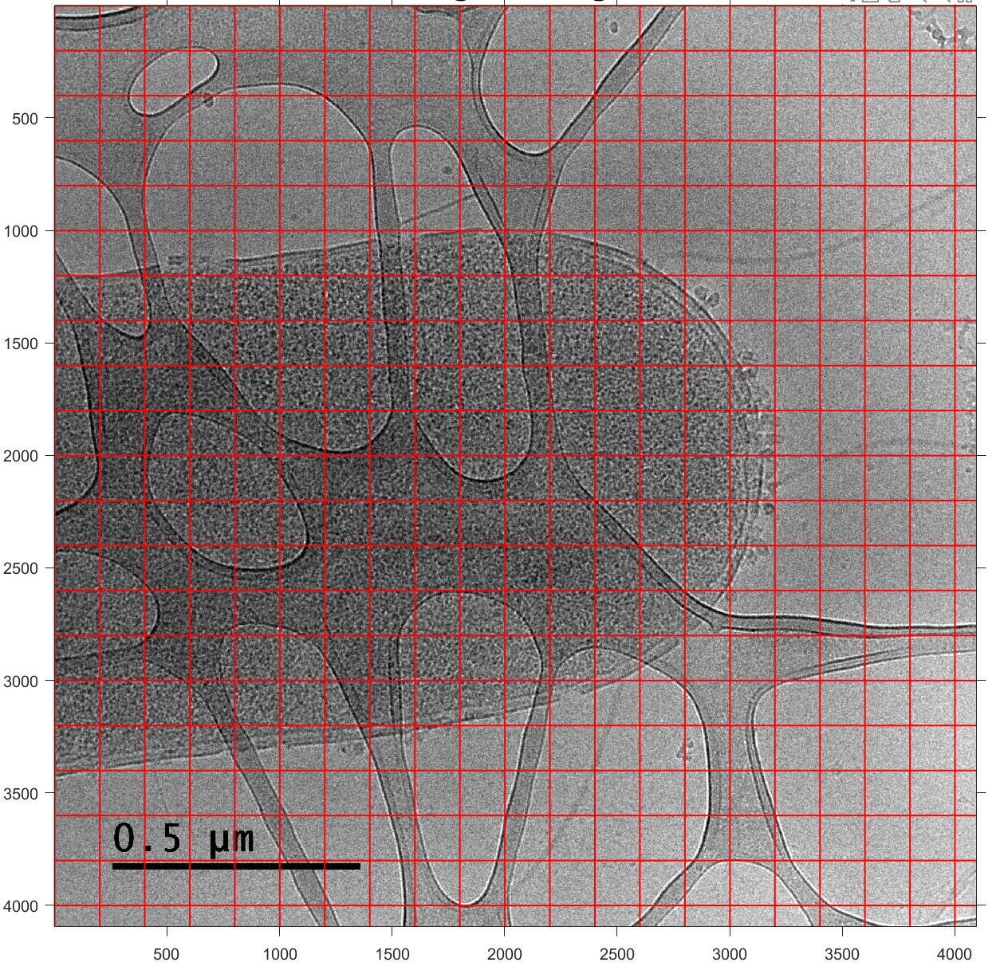

## last update: 2022-08-29 

## 1. Measure cell wrinkling 

**Add 200 x 200 grid to the picture, and measure the cell membrane length within a random square containing 4 grid.** 




<p align="center">
  
</p>


```
cd D:\Collaboration\Leora\PH2_24_untreated_ecoli\
clc;    % Clear the command window.
close all;  % Close all figures (except those of imtool.)
clear;  % Erase all existing variables. Or clearvars if you want.
workspace;  % Make sure the workspace panel is showing.
format long g;
format compact;
fontSize = 20;
I_4 = imread('PH2_24_untreated_15-20k-10df.jpg');
I_4 = im2gray(I_4)
imshow(I_4);

[rows, columns, numberOfColorChannels] = size(I_4);
hold on;
stepSize = 100;
for row = 1 : stepSize : rows
    line([1, columns], [row, row], 'Color', 'r', 'LineWidth', 1);
end
for col = 1 : stepSize : columns
    line([col, col], [1, rows], 'Color', 'r', 'LineWidth', 1);
end

title('Original Image', 'FontSize', fontSize);
axis on;
% Enlarge figure to full screen.
set(gcf, 'Units', 'Normalized', 'OuterPosition', [0 0 1 1]);
% Give a name to the title bar.
set(gcf, 'Name', 'Demo by ImageAnalyst', 'NumberTitle', 'Off')
uiwait(msgbox('Left click, then right click'));
[x, y, intensityProfile] = improfile();
% Plot crosses over where you clicked.
hold on;
plot(x, y, 'r-', 'LineWidth', 3);
% Plot line
plot([x(1), x(end)], [y(1), y(end)], 'r+', 'LineWidth', 3, 'MarkerSize', 20);
% Plot intensity profile in another plot.
subplot(2, 1, 2);
plot(intensityProfile, 'LineWidth', 3);
grid on;
title('Intensity Profile', 'FontSize', fontSize);
distance = sqrt((x(1) - x(end))^2 + (y(1) - y(end))^2)
message = sprintf('The distance = %.1f pixels.', distance);
uiwait(helpdlg(message));

```

