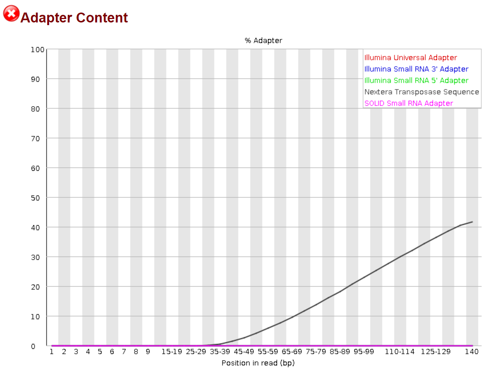
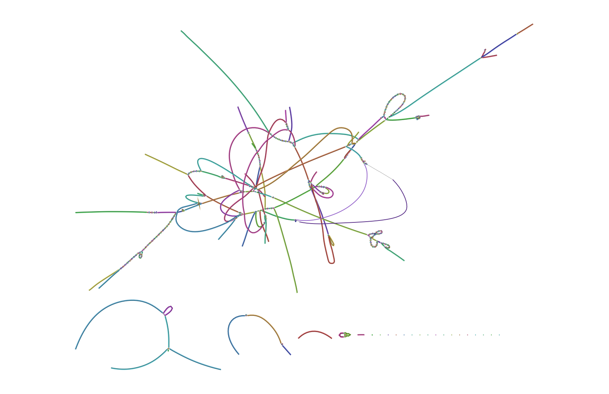
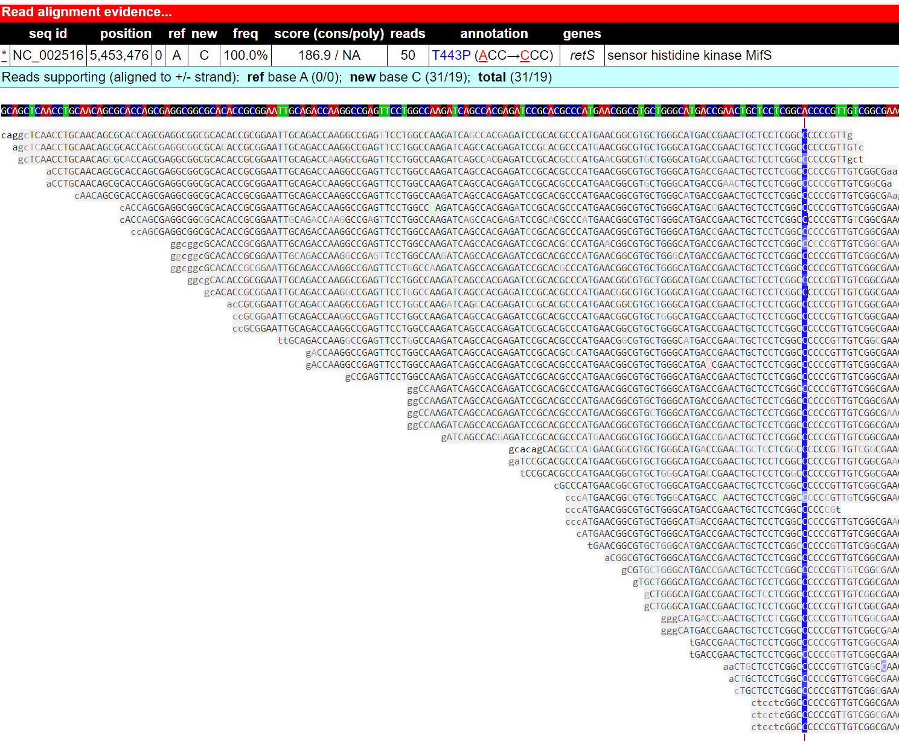

### Bacteria-phage genome analysis tutorial: A case study from a published paper

**Start: 2022-07-29**

**Last update: 2022-07-29**

---

## Paper: [Rampant prophage movement among transient competitors drives rapid adaptation during infection](https://www.science.org/doi/10.1126/sciadv.abh1489)

[Here](https://github.com/RunhangShu/RunhangWebsite/blob/main/content/en/2022-07-28-Prophage%20analysis.md) is a summary and rationale of this paper in my another post. 


### System information:

- OS: Linux-4.4.0-19041-Microsoft-x86_64-with-glibc2.31 (I used Windows Subsystem for Linux - Ubuntu in Mobaxterm in a Win10 PC)
- Memory limit (in Gb): 16
- CPU: i7-7700k (4 core)
- Python version: 3.9.12
- Conda: 4.13.0

### Bioinformatic tool overview:
- Download sequences from NCBI SRA: sratoolkit v3.0.0
- Quality Check: FastQC v0.11.9
- Read Trimming and filtering: Trimmomatic v0.36
- De novo short-reads Assemler: SPAdes v3.15.4
- Assembly visualization: Bandage v0.8.1
- Mutation calling: [Breseq v0.36.1](https://barricklab.org/twiki/pub/Lab/ToolsBacterialGenomeResequencing/documentation/index.html)
- Read alignment: Bowtie2 v2.4.5 (require to run Breseq)
- R v4.0.3 (required to run Breseq)
- Mobile genetic element mapping: [MGEFinder](https://github.com/bhattlab/MGEfinder)

------
<div id='id-section1'/>  

## Table of content
### 1. [Download sequence data in NCBI](#id-section1)
### 2. [Quality check, filtering, trimming](#id-section2)
### 3. [De novo assemble the short-reads using SPAdes](#id-section3)
### 4. [Mutation calling using Breseq](#id-section4)
### 5. [Mobile elements detection using MGEFinder](#id-section5)

------

## 1. Directly download sequence data of *Pseudomonas aeruginosa* in NCBI. 
All sequences from the paper were deposited in NCBI SRA: [PA14 BioProject:PRJNA491911](https://www.ncbi.nlm.nih.gov/bioproject/?term=PRJNA491911.), [PAO1 BioProject:PRJNA633671](https://www.ncbi.nlm.nih.gov/bioproject/PRJNA633671). In NCBI Bioproject, click the sample you are interested; save all SRR numbers of the samples into an accession list. It will be a txt file, which will be used in next step. 

<p align="center">
    
</p>

### Download sratoolkit binaries [here](https://github.com/ncbi/sra-tools/wiki/01.-Downloading-SRA-Toolkit) into your operating system. 

### Run you downloaded Accession_list file with the following command using a bash file. 
Bash file (.sh) is a powerful file store all scripts and can be read by the Linux system. [See how to use nano to create a bash file](https://www.tomshardware.com/how-to/write-bash-scripts-linux). 

```
#! /bin/bash
### set up a PATH variable to tell you OS where to find the tool. 
export PATH=$PATH:/mnt/c/Users/darsonshu/Documents/Siryaporn_lab/tools/sratoolkit.3.0.0-ubuntu64/bin
prefetch --option-file Accession_list.txt
for i in $(cat Accession_list.txt); do echo $i; date; fasterq-dump -S $i/$i.sra -O output_dir; done
```
This step downloaded the two fastq files (Illumina paired-reads) for each sample in your "output_dir" folder

------
<div id='id-section2'/>  

## 2. Quality check, trimming, and filtering 

### Run fastqc to check the sequence quality  
```
mkdir fastqc_output ### create a new folder for fastqc results
fastqc ./output_dir/* -o fastqc_output/ ### I assume you current working directory is not the fastq "output_dir". 
### The star sign means you want the program to take every file in that folder.
```

<p align="center">
    
</p>

*There is obvious Illumina sequencing adapter in the sequences, which needs to be trimmed before further analysis.* 

### Use a loop function to run Trimmomatic. 
I set NexteraPE-PE.fa:2:30:10 because the previous step tells us the sequences contain Nextera adapters. 
```
cd output_dir ### go to the fastq folder
for file in ./*_1.fastq
do
withpath="${file}"
filename=${withpath##*/}
base="${filename%*_*.fastq}"
echo "${base}"
java -jar ../Trimmomatic-0.36/trimmomatic-0.36.jar PE ./"${base}"*_1.fastq ./"${base}"*_2.fastq ./"${base}"_1.trimmed_PE.fastq ./"${base}"_1.trimmed_SE.fastq ./"${base}"_2.trimmed_PE.fastq ./"${base}"_2.trimmed_SE.fastq \
ILLUMINACLIP:../Trimmomatic-0.36/adapters/NexteraPE-PE.fa:2:30:10 LEADING:3 TRAILING:3 SLIDINGWINDOW:4:20 MINLEN:36
done
```
### Check the trimmed sequence with fastqc again. 

```
mkdir trimmed_fastqc
fastqc *trimmed* -o trimmed_fastqc ### Again, the star signs tell the program to only take the trimmed fastq file. 
```
<p align="center">
    
</p>


Now, the sequence data look much more cleaner. We can start the next step of assembly, alignment, and etc.

------
<div id='id-section3'/>    

## 3. De novo assemble the short-reads using SPAdes

### I downloaded SPAdes binaries for linux [here](https://cab.spbu.ru/software/spades/). 
### Run the following command
```
#! /bin/bash
# tell your linux shell where to look for executable file 
export PATH=$PATH:/mnt/c/Users/darsonshu/Documents/Siryaporn_lab/Pseudomonas_Sci_Advan/SPAdes-3.15.4-Linux/bin
for file in ./*_1.trimmed_PE.fastq
do
withpath="${file}"
filename=${withpath##*/}
base="${filename%*_1.trimmed_PE*.fastq}"
echo "${base}"
mkdir spades_output_"${base}"
spades.py --isolate --only-assembler -1 ./"${base}"_1.trimmed_PE.fastq -2 ./"${base}"_2.trimmed_PE.fastq -o spades_output_"${base}"
done
``` 
### Vitualize the assembly 
The file "assembly_graph.fastg" generated by SPAdes can be visualized in Bandage as shown below. Clearly, the assembly has many nodes and edges. So, the assembly level is **Contig level**, as compared to **Complete genome level** of PA14/PA01 reference genome (NC_008463.1/NC_002516.2). 

<p align="center">
    
</p>

> ***Question: What are the main differences between "complete genome" and a "contig level draft genome"? How do people curate draft genome to complete circular bacterial genome?*** 

------

<div id='id-section4'/>    

## 4. Mutation calling using Breseq
Breseq uses trimmed, unassembled illumina short-reads to align a reference genome and detect bacterial genetic mutations/insertions/indels. It is able to compare multiple clones with <1,000 genetic differences. 

### Download PA14 reference genome [NC_008463.1 from NCBI-SRA](https://www.ncbi.nlm.nih.gov/nuccore/NC_008463.1)
Make sure you select **show sequence** in the "customize view" and click "update view" and download the genebank (.gb) file manually. 

<p align="center">
    
</p>


### Run the following command

```
#! /bin/bash
for file in spades_output*;
do
base="${file##spades_output_}";
echo "${base}";
mkdir spades_output_"${base}"/breseq
#### The input files are the trimmomatic output files (.fastq) and one reference genome PA01_reference_genome.gb
breseq -r /mnt/c/Users/darsonshu/Documents/Siryaporn_lab/tools/PA01_reference_genome.gb \
/mnt/c/Users/darsonshu/Documents/Siryaporn_lab/Pseudomonas_Sci_Advan/PA01_variants_fastq/"${base}"_1.trimmed_PE.fastq \
/mnt/c/Users/darsonshu/Documents/Siryaporn_lab/Pseudomonas_Sci_Advan/PA01_variants_fastq/"${base}"_2.trimmed_PE.fastq \
-o spades_output_"${base}"/breseq
done
```

### Explore the output HTML file
Breseq's output summary file is an interactive HTML file contains a lot of information. The figure below is a screenshot of the output. It lists all genetic mutations of the inquiry genome in relation to the reference genome. 

<p align="center">
    
</p>

**I repeated the discovery shown in the paper that PA01 isolate 41 (SRR11809631) has one point mutation in retS gene**. This SNP leads to redish colony morphologies and hyperbiofilm-forming of PA01.  

<p align="center">
    
</p>

If you run multiple strains and want to put all summaries into one table, use [gdtools of breseq](https://barricklab.org/twiki/pub/Lab/ToolsBacterialGenomeResequencing/documentation/gd_usage.html). 

------
<div id='id-section5'/>    

### MGEFinder
